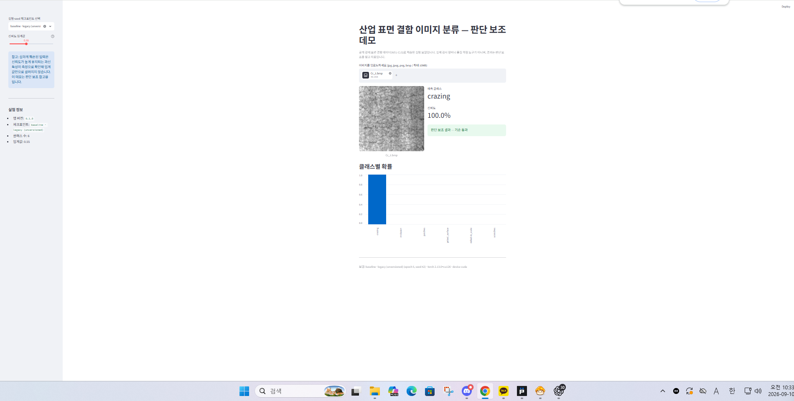

# 데모 결과 화면 증빙

## 캡처 대상

- 앱: 산업 표면 결함 이미지 분류 — 판단 보조 데모
- 주소: `http://127.0.0.1:8501`
- 선택 체크포인트: `baseline · legacy (unversioned)`
- 입력 이미지: `data/raw/NEU-CLS/NEU-CLS/Cr_1.bmp`
- 화면 결과: `crazing`, 신뢰도 `100.0%`, `판단 보조 결과 — 기준 통과`

## 원본 화면

## 무결성

- 파일: `docs/screenshots/demo-result-baseline-legacy-cr1-cropped.png`
- SHA-256: `2BD9A10D09790681E1BAD0B74AD9FEE87C009AC3828CE7A13906A173860996C2`
- 결과 영역만 보이도록 원본 화면을 결정론적으로 크롭했다. 예측 결과·입력 파일명·선택한 legacy 체크포인트·모델 메타데이터는 변경하지 않았다.

이 증빙은 사용자 제공 화면과 실제 로컬 앱 실행을 연결하기 위한 기록이다. 분류 결과는 공개 NEU-CLS 기반 실험 모델의 판단 보조 결과이며, 실제 검사 장비의 품질 확정에는 사용하지 않는다.
